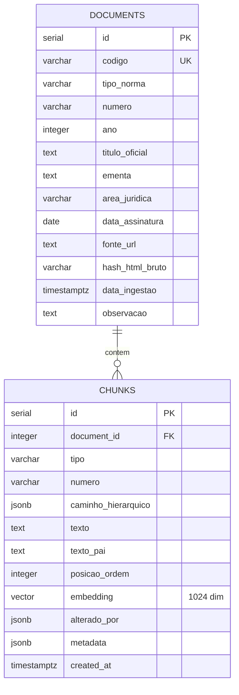

# Croqui do banco de dados — v1

> **Status:** rascunho para revisão.
> **Solicitado por:** Prof. Tarcísio Lemos (coorientador)
> **Autor:** Jhonatan
> **Data:** maio/2026
> **Bloco:** Semana 3, Bloco 2 — modelagem do schema
>
> Esse documento é a primeira proposta de schema para o JusBot. As decisões aqui são revisáveis. Pedimos especialmente revisão dos pontos listados em "Decisões em aberto" no fim do documento.

---

## Visão geral

O JusBot ingere textos jurídicos brasileiros (CDC, CLT, FGTS, 13º) e disponibiliza um RAG (Retrieval-Augmented Generation) para consultas em linguagem natural. O schema precisa:

- Armazenar a identidade de cada lei (`documents`).
- Armazenar cada unidade jurídica recuperável — artigo, parágrafo, inciso, alínea — com seu embedding vetorial (`chunks`).
- Preservar o caminho hierárquico de cada unidade (relevante especialmente para a CLT, que tem Título → Capítulo → Seção → Artigo).
- Permitir busca híbrida: lexical (pg_trgm) + semântica (pgvector).

Volume estimado do corpus inicial: 5 documentos, ~1.500 chunks.

---

## Diagrama ER

---

## Tabela `documents`

Armazena os metadados de cada lei ingerida. Uma linha por lei.

| Campo | Tipo | Constraint | Justificativa |
|-------|------|------------|---------------|
| `id` | `SERIAL` | `PRIMARY KEY` | Auto-incremento. Suficiente para MVP (5 docs). UUID foi considerado mas dispensado por simplicidade. |
| `codigo` | `VARCHAR(50)` | `UNIQUE NOT NULL` | Identificador legível (`lei-8078-1990`, `del-5452-1943`). Facilita queries manuais e logs. |
| `tipo_norma` | `VARCHAR(30)` | `NOT NULL` | Valores: `lei`, `decreto-lei`. Permite extensão futura (`lei-complementar`, `medida-provisoria`). |
| `numero` | `VARCHAR(20)` | `NOT NULL` | Ex: `"8.078"`, `"5.452"`. VARCHAR porque alguns números têm sufixo (`8.213-A`). |
| `ano` | `INTEGER` | `NOT NULL` | Ex: `1990`, `1943`. Útil para filtros por época. |
| `titulo_oficial` | `TEXT` | `NOT NULL` | Citação completa: `"LEI Nº 8.078, DE 11 DE SETEMBRO DE 1990"`. Extraído do cabeçalho do HTML. |
| `ementa` | `TEXT` | `NULL` | Descrição oficial. Ex: `"Dispõe sobre a proteção do consumidor..."`. |
| `area_juridica` | `VARCHAR(20)` | `NOT NULL` | Valores: `consumidor`, `trabalho`. Permite filtrar busca vetorial por área antes do RAG. |
| `data_assinatura` | `DATE` | `NULL` | Data de promulgação. |
| `fonte_url` | `TEXT` | `NOT NULL` | URL canônica no Planalto. Reprodutibilidade. |
| `hash_html_bruto` | `VARCHAR(64)` | `NOT NULL` | SHA-256 do HTML bruto ingerido. Garante que reingestões do mesmo input produzam o mesmo output (rigor científico para o TCC). |
| `data_ingestao` | `TIMESTAMPTZ` | `NOT NULL DEFAULT NOW()` | Quando o documento foi processado. |
| `observacao` | `TEXT` | `NULL` | Notas adicionais (ex: `"DOU de 12.9.1990, retificado em 10.1.2007"`). |

### Índices
- `UNIQUE(codigo)` — automático
- `INDEX(area_juridica)` — filtro frequente no pipeline RAG

---

## Tabela `chunks`

Armazena cada unidade jurídica recuperável (artigo, parágrafo, inciso, alínea). É a tabela consultada pelo RAG.

| Campo | Tipo | Constraint | Justificativa |
|-------|------|------------|---------------|
| `id` | `SERIAL` | `PRIMARY KEY` | |
| `document_id` | `INTEGER` | `FK documents(id) NOT NULL` | `ON DELETE CASCADE` — se removemos um documento, removemos seus chunks. |
| `tipo` | `VARCHAR(20)` | `NOT NULL` | Valores: `artigo`, `paragrafo`, `inciso`, `alinea`. |
| `numero` | `VARCHAR(20)` | `NOT NULL` | **TEXT, não INT.** Lei 8.036 tem `Art. 58-A`, CLT tem `Art. 75-F`. INT não cabe. |
| `caminho_hierarquico` | `JSONB` | `NULL` | Caminho completo: `{"titulo": "II", "capitulo": "I", "secao": "II", "artigo": "58-A"}`. NULL para documentos planos (CDC, Lei 4.090). |
| `texto` | `TEXT` | `NOT NULL` | O conteúdo do chunk. Limpo de tags HTML. |
| `texto_pai` | `TEXT` | `NULL` | Contexto do pai. Ex: para um parágrafo, o texto do artigo onde ele está. Resolve o problema de chunks soltos perderem contexto jurídico — abordagem alinhada com o ADR-005 (chunking hierárquico). |
| `posicao_ordem` | `INTEGER` | `NOT NULL` | Ordem do chunk no documento. Permite reconstruir o texto original em sequência. |
| `embedding` | `vector(1024)` | `NULL` | Embedding gerado pelo `multilingual-e5-large`. NULL inicialmente — o pipeline insere o chunk primeiro e gera o embedding em batch depois. Permite trocar o modelo de embedding sem re-ingerir. |
| `alterado_por` | `JSONB` | `NULL` | Quando o trecho foi alterado por lei posterior. Ex: `{"lei": "9.008/1995", "url": "L9008.htm#art7"}`. Extraído dos links `<a href>` com "Redação dada por". |
| `metadata` | `JSONB` | `NULL` | Campo de extensão. Atualmente reservado para casos especiais (alíneas, listas numéricas da CLT). |
| `created_at` | `TIMESTAMPTZ` | `DEFAULT NOW()` | |

### Índices
- `INDEX(document_id)` — joins frequentes
- `INDEX(tipo)` — filtros por tipo de unidade
- `INDEX caminho_hierarquico USING GIN` — busca em JSONB (ex: "todos chunks do Capítulo IV")
- `INDEX texto USING GIN (gin_trgm_ops)` — **busca lexical com pg_trgm** (parte da busca híbrida)
- `INDEX embedding USING hnsw (vector_cosine_ops)` — **busca vetorial com pgvector** (similaridade por cosseno)

---

## Decisões técnicas registradas

### 1. JSONB para hierarquia (em vez de tabelas separadas por nível)

**Decisão:** representar Título/Capítulo/Seção como campo JSONB no chunk.

**Justificativa:**
- Profundidade varia entre documentos (CDC plano, CLT com 4 níveis, leis curtas sem hierarquia). Tabelas separadas obrigariam linhas vazias.
- Hierarquia é leitura, não escrita. Não temos query crítica do tipo "todos artigos do Capítulo X" em SQL — isso é feito pelo retrieval vetorial com filtro.
- JSONB tem suporte nativo a índices GIN no PostgreSQL.

**Alternativa considerada:** extensão `ltree` (caminhos hierárquicos com sintaxe `titulo2.capitulo1.secao2.artigo58a`). Mais elegante semanticamente, adiciona uma extensão a mais no setup. **Aberto para discussão.**

### 2. `numero` como VARCHAR

**Decisão:** `chunks.numero` é `VARCHAR(20)`, não `INTEGER`.

**Justificativa:** CLT tem artigos como `58-A`, `75-F`, `223-G`. Lei 8.036 também. INT não cabe.

### 3. `embedding` permite NULL

**Decisão:** `chunks.embedding` é nullable.

**Justificativa:**
- Pipeline em duas fases: ingestão de texto primeiro, geração de embeddings depois (batch processing).
- Permite trocar modelo de embedding (re-rodar pipeline) sem perder texto.
- Trade-off: aplicação precisa verificar `IS NOT NULL` antes de buscar.

### 4. Índice vetorial: HNSW

**Decisão:** `INDEX USING hnsw` em vez de `ivfflat`.

**Justificativa:**
- HNSW tem consulta mais rápida (caminho crítico no RAG: usuário aguardando resposta).
- ivfflat tem build mais rápido, mas o índice é construído uma única vez no setup do corpus.
- Custo de memória do HNSW é aceitável para 1.500 chunks.

### 5. Busca híbrida (pgvector + pg_trgm)

**Decisão:** combinar busca lexical (`pg_trgm` com `gin_trgm_ops`) e semântica (`pgvector`).

**Justificativa:** alinhado com a literatura de RAG jurídico (Pipitone & Houir Alami, 2024 — LegalBench-RAG). Termos jurídicos específicos (`art. 477`, `aviso prévio`) podem não ser bem capturados só por similaridade semântica. Híbrido melhora recall.

### 6. Reprodutibilidade científica (hash do HTML bruto)

**Decisão:** armazenar `hash_html_bruto` (SHA-256) em cada documento.

**Justificativa:** rigor metodológico para o TCC. Permite verificar que o pipeline rodando sobre os mesmos HTMLs produz os mesmos chunks. Importante na avaliação empírica da Semana 11.

---

## Decisões em aberto — pedimos opinião

### Pergunta 1 — JSONB ou LTREE para hierarquia?

A decisão atual é JSONB (`caminho_hierarquico`). Faz sentido para os volumes do MVP, mas LTREE poderia ser tecnicamente mais elegante para representar caminhos. O senhor recomenda alguma das duas?

### Pergunta 2 — `posicao_ordem` simples ou particionada?

A coluna `posicao_ordem` é um `INTEGER` linear por documento. Para 1.500 chunks isso é suficiente. Se o corpus crescer no futuro (Trabalhos Futuros prevê expansão para outras áreas), particionar por `document_id` faria sentido?

### Pergunta 3 — Cláusula `texto_pai` é redundante?

A coluna `chunks.texto_pai` duplica conteúdo (o texto do artigo aparece tanto no chunk-artigo quanto nos chunks-parágrafo-filhos). Resolve o problema de chunks soltos perderem contexto, mas custa armazenamento. Outras opções:
- (A) Manter `texto_pai` (decisão atual)
- (B) Reconstruir contexto em tempo de retrieval via JOIN (`chunk.parent_id`)
- (C) Sem contexto pai — chunk vai sozinho pro LLM

### Pergunta 4 — Versionamento de corpus

O MVP congela o corpus em uma data X. Se uma lei for alterada após a ingestão, simplesmente reingerimos sobrescrevendo. Não há versionamento de chunks ao longo do tempo. Para o TCC isso é suficiente, mas o senhor vê problema na premissa?

### Pergunta 5 — Particionamento físico

Para 1.500 chunks, não vejo necessidade de particionamento. Concorda?

### Pergunta 6 — Tabela `chunks` cresce muito?

Em projeção: CDC (~120 chunks) + CLT (~1.000 chunks no escopo do MVP, dado que filtramos só capítulos relevantes) + 8.036 (~200) + 4.090 (~10) + 4.749 (~12) ≈ 1.350. Cresce ~30% se incluirmos parágrafos como chunks separados. Total provável: ~1.500-1.800. Suporta normalmente?

---

## Próximos passos após revisão

1. Incorporar feedback do orientador no schema.
2. Escrever migrations do Alembic baseadas no schema final.
3. Implementar o parser HTML que popula essas tabelas (Bloco 3 da Semana 3).
4. Registrar decisões finais como ADRs no CLAUDE.md.

---

*Documento gerado em maio/2026 como parte do Bloco 2 da Semana 3 do TCC JusBot. Revisão técnica pelo Prof. Tarcísio Lemos pendente antes de implementação.*
