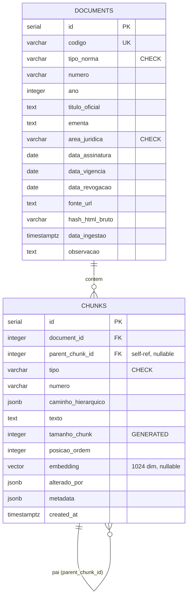

# Croqui do banco de dados — v2

> **Status:** aprovado para implementação.
> **Revisado por:** Prof. Tarcísio Lemos (coorientador) — aprovado com ajustes incorporados.
> **Autor:** Jhonatan • **Co-autor:** Diogo Caldeira
> **Data:** maio/2026 • **Bloco:** Semana 3, Bloco 2
>
> Sucede o `croqui_banco_v1`. As decisões em aberto do v1 foram fechadas após revisão. Este documento é a especificação para as migrations do Alembic e o parser HTML (Bloco 3). As justificativas detalhadas estão nos ADRs referenciados.

---

## Visão geral

O JusBot ingere textos jurídicos brasileiros (CDC, CLT, FGTS, 13º) e expõe um RAG para consultas em linguagem natural. O schema armazena a identidade de cada lei (`documents`) e cada unidade jurídica recuperável (`chunks`) com seu embedding, preservando o caminho hierárquico e suportando busca híbrida (lexical `pg_trgm` + semântica `pgvector`).

Volume do corpus inicial: 5 documentos, ~1.500–1.800 chunks.

---

## Diagrama ER



---

## Tabela `documents`

Uma linha por lei.

| Campo | Tipo | Constraint |
|-------|------|------------|
| `id` | `SERIAL` | `PRIMARY KEY` |
| `codigo` | `VARCHAR(50)` | `UNIQUE NOT NULL` — ex: `lei-8078-1990` |
| `tipo_norma` | `VARCHAR(30)` | `NOT NULL CHECK (tipo_norma IN ('lei','decreto-lei'))` |
| `numero` | `VARCHAR(20)` | `NOT NULL` — VARCHAR por causa de sufixos (`8.213-A`) |
| `ano` | `INTEGER` | `NOT NULL` |
| `titulo_oficial` | `TEXT` | `NOT NULL` |
| `ementa` | `TEXT` | `NULL` |
| `area_juridica` | `VARCHAR(20)` | `NOT NULL CHECK (area_juridica IN ('consumidor','trabalho'))` |
| `data_assinatura` | `DATE` | `NULL` |
| `data_vigencia` | `DATE` | `NULL` — **novo (v2)**, preparo p/ versionamento futuro |
| `data_revogacao` | `DATE` | `NULL` — **novo (v2)**, preparo p/ versionamento futuro |
| `fonte_url` | `TEXT` | `NOT NULL` — URL canônica no Planalto |
| `hash_html_bruto` | `VARCHAR(64)` | `NOT NULL` — SHA-256 do HTML bruto (reprodutibilidade) |
| `data_ingestao` | `TIMESTAMPTZ` | `NOT NULL DEFAULT NOW()` |
| `observacao` | `TEXT` | `NULL` |

**Índices:** `UNIQUE(codigo)` (automático) · `INDEX(area_juridica)`

---

## Tabela `chunks`

Cada unidade jurídica recuperável. Tabela consultada pelo RAG.

| Campo | Tipo | Constraint |
|-------|------|------------|
| `id` | `SERIAL` | `PRIMARY KEY` |
| `document_id` | `INTEGER` | `NOT NULL REFERENCES documents(id) ON DELETE CASCADE` |
| `parent_chunk_id` | `INTEGER` | `NULL REFERENCES chunks(id) ON DELETE CASCADE` — **novo (v2)**, substitui `texto_pai` (ADR-006) |
| `tipo` | `VARCHAR(20)` | `NOT NULL CHECK (tipo IN ('artigo','paragrafo','inciso','alinea','item'))` (ADR-009) |
| `numero` | `VARCHAR(20)` | `NOT NULL` — parágrafo único = `numero='único'` |
| `caminho_hierarquico` | `JSONB` | `NULL` — caminho estrutural; `NULL` p/ docs planos (ADR-008) |
| `texto` | `TEXT` | `NOT NULL` — conteúdo limpo de HTML. Para `tipo='artigo'`, guarda o **caput** |
| `tamanho_chunk` | `INTEGER` | `GENERATED ALWAYS AS (length(texto)) STORED` — **novo (v2)**, coluna calculada |
| `posicao_ordem` | `INTEGER` | `NOT NULL` — ordem linear dentro do documento |
| `embedding` | `vector(1024)` | `NULL` — `multilingual-e5-large`; preenchido em batch após ingestão |
| `alterado_por` | `JSONB` | `NULL` — alteração por lei posterior (ver formato abaixo) |
| `metadata` | `JSONB` | `NULL` — extensão; sem schema fixo no MVP |
| `created_at` | `TIMESTAMPTZ` | `NOT NULL DEFAULT NOW()` |

**Índices:**
- `INDEX(document_id, posicao_ordem)` — composto; cobre também filtros só por `document_id` (prefixo à esquerda), tornando um índice isolado de `document_id` redundante
- `INDEX(parent_chunk_id)` — busca de filhos de um nó (reconstrução hierárquica)
- `INDEX(tipo)`
- `INDEX caminho_hierarquico USING GIN` — busca em JSONB
- `INDEX texto USING GIN (gin_trgm_ops)` — busca lexical (`pg_trgm`)
- `INDEX embedding USING hnsw (vector_cosine_ops) WHERE embedding IS NOT NULL` — **partial (v2)**; ignora chunks sem embedding. Parâmetros padrão (`m=16`, `ef_construction=64`) suficientes para o volume

---

## Formato dos campos JSONB

Documentado para consistência do parser (recomendação da revisão).

**`caminho_hierarquico`** — chaves presentes conforme a profundidade do documento:
```json
{"titulo": "II", "capitulo": "I", "secao": "II", "artigo": "58-A"}
```

**`alterado_por`** — schema mínimo:
```json
{
  "lei": "9.008/1995",
  "url": "L9008.htm#art7",
  "dispositivo_alterado": "art. 58-A",
  "data_publicacao": "1995-03-21"
}
```

**`metadata`** — campo de extensão, sem schema fixo. Reservado para casos especiais (ex.: itens de alíneas, marcações de listas da CLT). Documentar o formato quando for efetivamente usado.

---

## Mudanças em relação ao v1

| # | Mudança | Origem | ADR |
|---|---------|--------|-----|
| 1 | `texto_pai` removido; `parent_chunk_id` (FK self-ref) adicionado. Contexto do pai reconstruído via JOIN/CTE recursiva, **sem view materializada** | Revisão (Pergunta 3) + decisão própria | ADR-006 |
| 2 | `tipo_norma` e `area_juridica` recebem `CHECK` em vez de migrarem para `ENUM` | Decisão própria (divergência fundamentada) | ADR-007 |
| 3 | Hierarquia confirmada como JSONB; LTREE registrado como trabalho futuro | Revisão (Pergunta 1) | ADR-008 |
| 4 | `tipo` ganha o valor `item` e o `CHECK` é ancorado na LC 95/1998; `caput` modelado como texto do chunk-artigo | Decisão própria | ADR-009 |
| 5 | `data_vigencia` e `data_revogacao` adicionados a `documents` | Revisão | — (preparo p/ versionamento) |
| 6 | `tamanho_chunk` adicionado como coluna **GENERATED** (não populada pelo parser) | Revisão + refino próprio | — |
| 7 | Índice composto `(document_id, posicao_ordem)` | Revisão | — |
| 8 | Índice HNSW vira **parcial** (`WHERE embedding IS NOT NULL`) | Revisão | — |

**Decisões mantidas do v1** (sem alteração): `numero` como VARCHAR, `embedding` nullable, índice HNSW (vs. ivfflat), busca híbrida `pgvector`+`pg_trgm`, `hash_html_bruto` para reprodutibilidade.

**Recusado com justificativa (ver ADRs):** view materializada para `texto_pai` (ADR-006), `ENUM` (ADR-007). **Adiado para trabalhos futuros:** tabela `fontes` normalizada e versionamento temporal por chunk (`vigencia_inicio`/`fim` em `chunks`).

---

## Próximos passos

1. Migrations do Alembic a partir deste schema.
2. Parser HTML que popula as tabelas (Bloco 3, Semana 3).
3. ADRs 006–009 registrados no `CLAUDE.md` / `docs/adr/`.

---

*Croqui v2 — TCC JusBot, Semana 3. Substitui o v1 após revisão técnica do Prof. Tarcísio Lemos.*
